# Практическая работа 10. Система инициализации.
## Постановка задачи
### Часть 1.

1. Выведите список всех служб.
2. Выберите 2 службы, для каждой:
    - проверьте статус;
    - отключите автозапуск, затем включите обратно;
    - перезапустите службу и убедитесь, что она активна.

### Часть 2.
1. Выберите службу, просмотрите её логи.
2. Найдите в логах сообщения об ошибках, проанализируйте, есть ли повторяющиеся ошибки. Предположите их причину.
3. Попробуйте исправить имеющиеся ошибки.
4. Очистите логи службы.
5. Проверьте новые записи в логах.

### Часть 3.
1. Создайте службу, которая:
    - выводит приветствие в /var/log/greeter.log каждые 3 минуты;
    - перезапускается при сбое;
    - при включении запускается после сетевых служб.
2. Запустите службу и проверьте её статус.
3. Настройте автозапуск.
4. Проверьте содержимое /var/log/greeter.log
5. Остановите, выключите и удалите службу.

## Ход работы
### Часть 1
#### Шаг 1. Вывел список всех служб
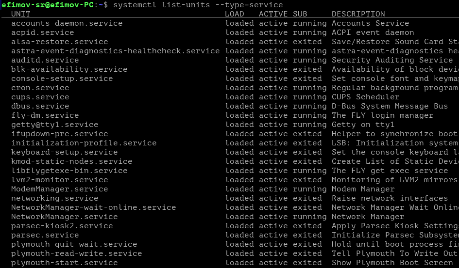
#### Шаг 2. Проверил статусы 2 служб
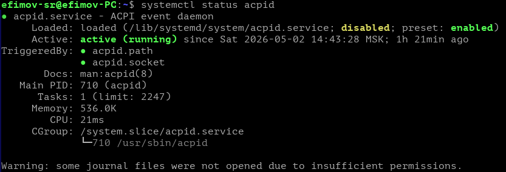
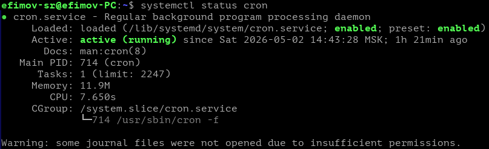
#### Шаг 3. Отключил автозапуск для этих служб
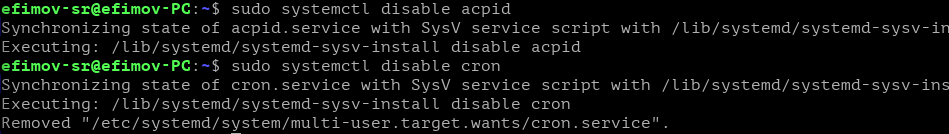
#### Шаг 4. Проверил статус служб
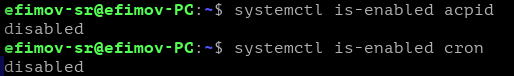
#### Шаг 5. Включил автозапуск обратно
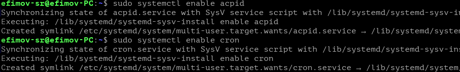
#### Шаг 6. Перезапустил службы
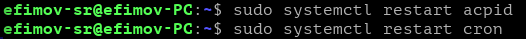

### Часть 2
#### Шаг 1. Вывел логи выбранной службы
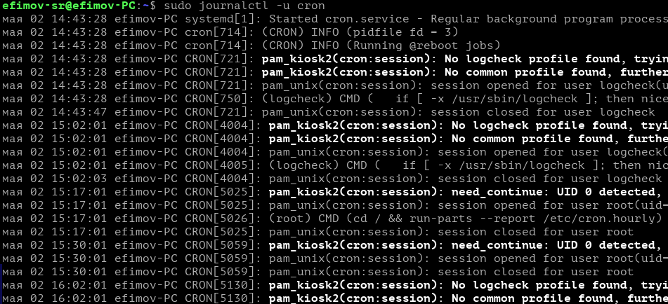
#### Шаг 2. Вывел ошибки выбранной службы (ошибок не было)
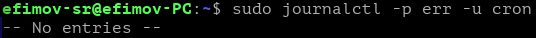
#### Шаг 3. Очистил логи
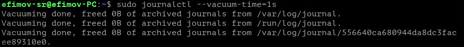
#### Шаг 4. Вывел новые логи после очистки
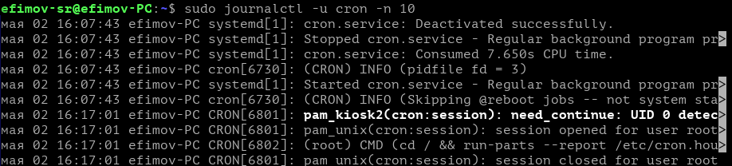

### Часть 3
#### Шаг 1. Создал скрипт, который каждые 180 секунд выводит Hello everyone и дату

#### Шаг 2. Создал unit-файл для службы
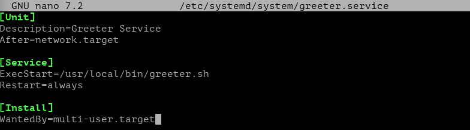
#### Шаг 3. Запустил службу и проверил её статус
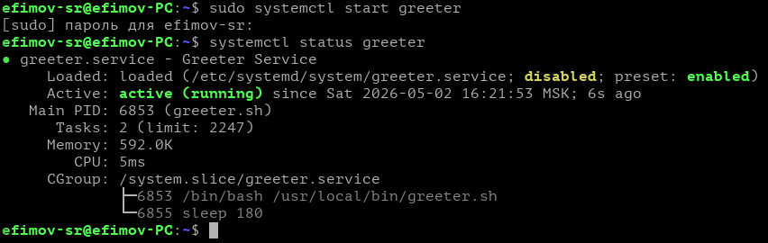
#### Шаг 4. Включил автозапуск для службы
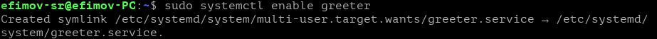
#### Шаг 5. Вывел логи службы, после чего остановил службу и отключил
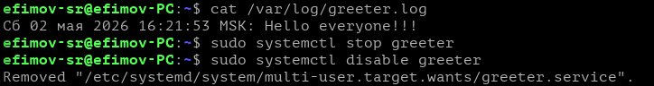
#### Шаг 6. Удалил службу
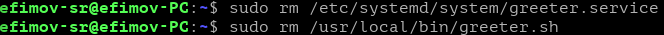
