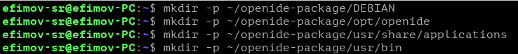
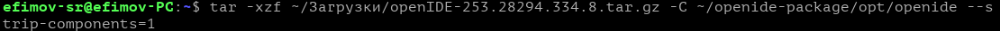
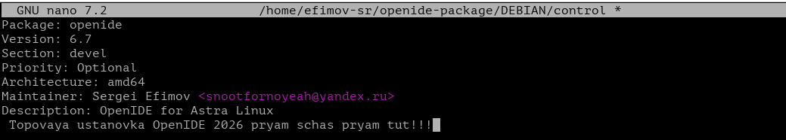
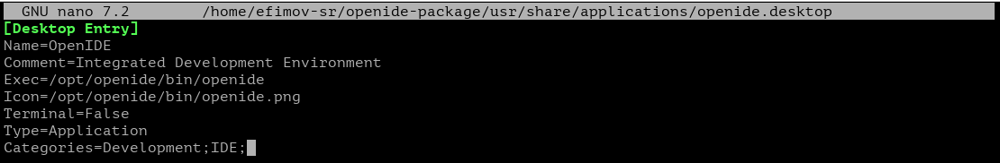
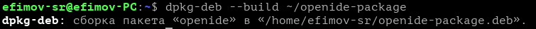
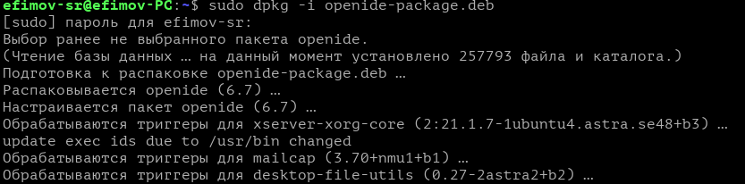
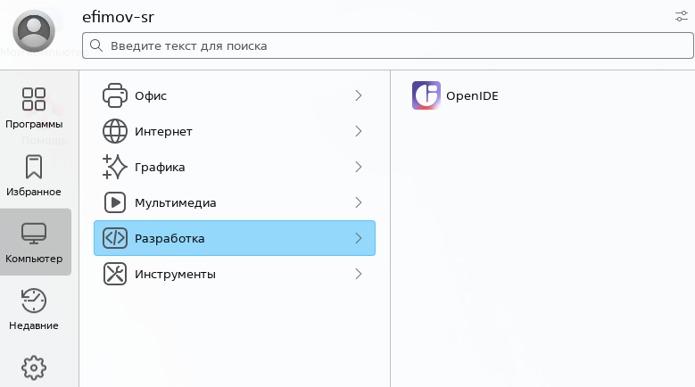

# Практическая работа 7. Упаковка OpenIDE в deb-пакет.
## Постановка задачи
Упакуйте в deb-пакет PyCharm ИЛИ OpenIDE. Для создания пакета используйте архив с бинарными файлами с официального сайта выбранной IDE. После установки пакета IDE должна быть доступна для запуска любому пользователю. Учтите, что пакет должен не только установить программу, но и создать ярлык в разделе "Разработка" меню "Пуск".
## Ссылка на пакет
[Пакет](https://disk.yandex.ru/d/PRqBRB8AfMD-Og)
## Ход работы
### Шаг 1. Создание структуры каталогов

### Шаг 2. Распаковка архива OpenIDE

### Шаг 3. Создание файла управления

### Шаг 4. Создание ярлыка в меню Пуск

### Шаг 5. Сборка пакета

### Шаг 6. Проверка установки пакета

### Шаг 7. Результат
