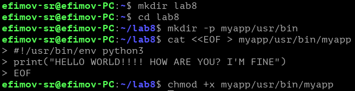
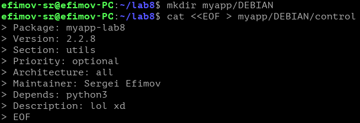
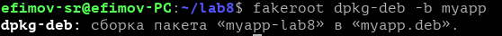
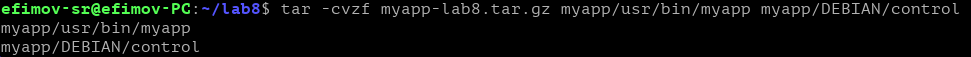
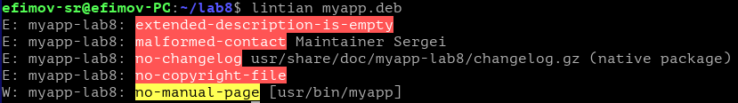
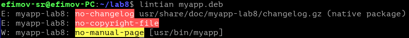

# Практическая работа 8. Упаковка программы в бинарный пакет.
## Постановка задачи
Напишите небольшую программу (язык программирования – на ваш выбор). Упакуйте получившуюся программу в бинарный (deb) И исходный пакеты.

Проверьте получившиеся пакеты с помощью lintian. Проанализируйте вывод и внесите необходимые изменения.

Получившиеся пакеты выложите в репозиторий GitHub/GitLab/GitFlic и прикрепите ссылку на него к отчёту.
## Ход работы
### Шаг 1. Создание директории
1. Создал директорию myapp, где в /usr/bin/ положил файл скрипта.
2. Написал скрипт на Python
3. Настроил права доступа, чтобы можно было запускать программу

### Шаг 2. Подготовка данных
1. Создал папку DEBIAN
2. В файл control записал разные данные (версию, описание и т. д.)

### Шаг 3. Сборка бинарного пакета
1. Превратил папку в установочный файл с помощью fakeroot

### Шаг 4. Создание исходного пакета
1. Создал сжатый tar-архив

### Шаг 5. Проверка пакета с помощью lintian
1. Проверил пакет с помощью lintian

2. Исправил некоторые ошибки, которые вывел lintian

